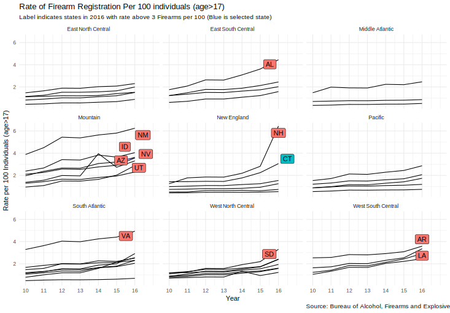
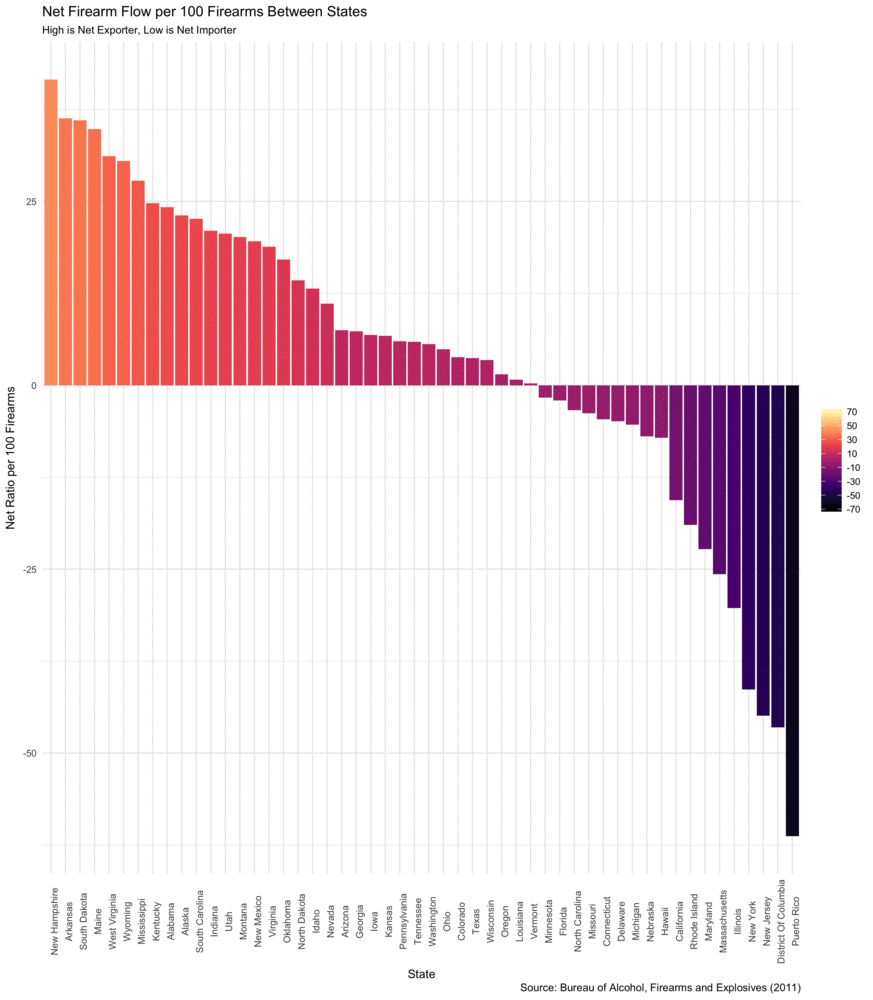
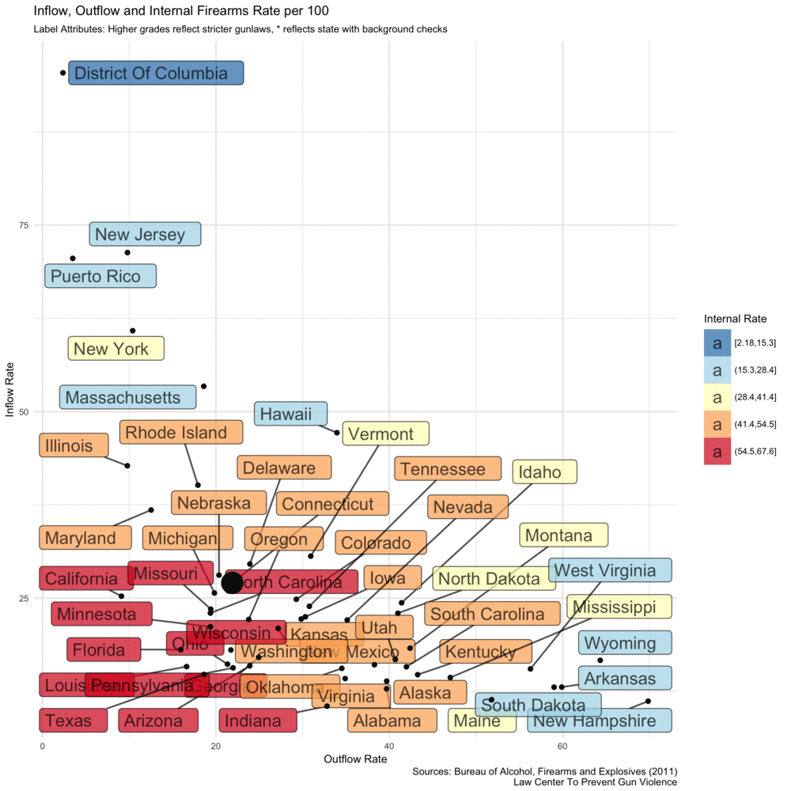
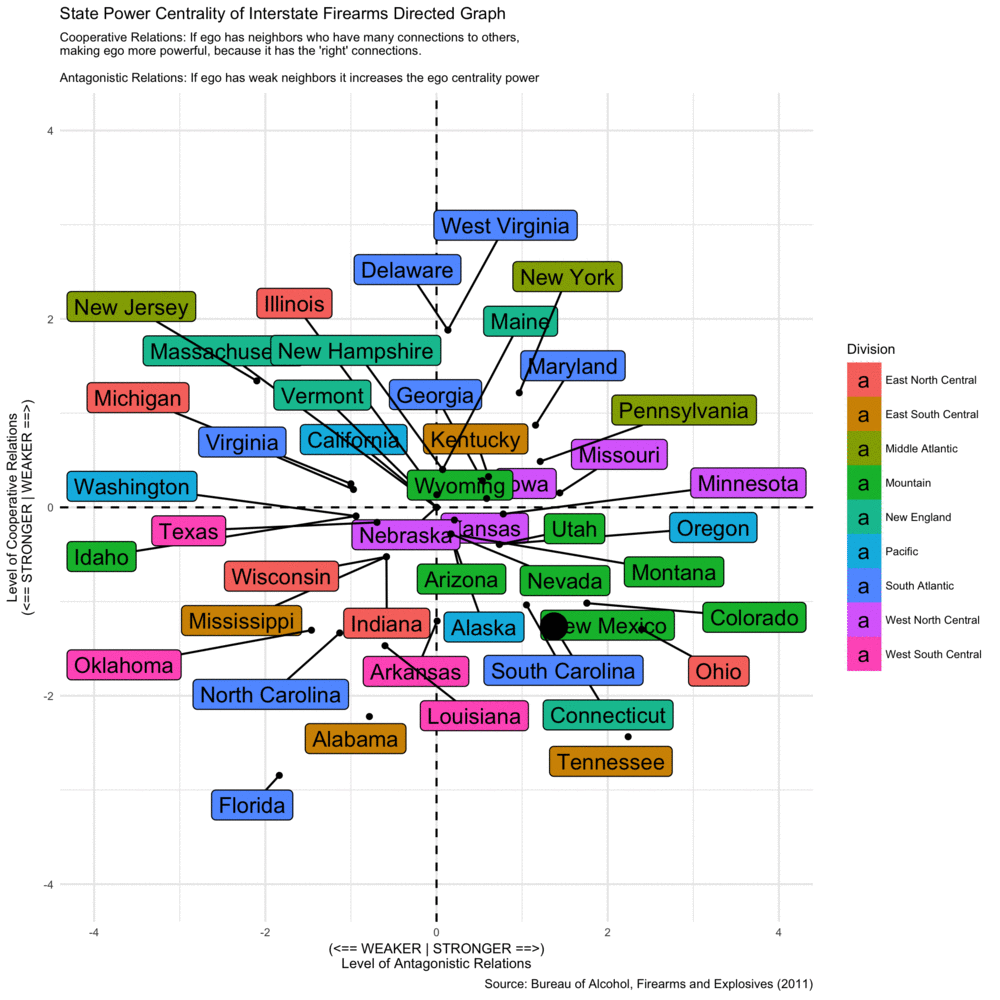

```{r setup, include=FALSE}
knitr::opts_chunk$set(collapse = TRUE)
```

I want to try and probe a question that was raised since Las Vegas and now revived due to Sutherland Springs,TX: Can a state regulate firearms on it's own, given the free trade between jurisdictions. This post will try to start to give an answer to this question using R.

Since there is not an open electronic federal database for firearm ownership and transactions, one important source of information is the [Bureau of Alcohol, Tobacco and Firearms](https://www.atf.gov/resource-center/firearms-trace-data-2016), (ATF). They publish the trace of firearms that were recovered every year, and when *possible* trace the state where the firearm originated. This creates a weighted adjaceny matrix that is similar to what in economics is called [Direction of Trade](http://www.imf.org/external/pubs/cat/longres.aspx?sk=20096). 

In this [matrix](https://www.atf.gov/docs/undefined/sourcerecoverybystatecy2016xlsx/download) the rows depict the source and the columns depict the destination. This lets one get an idea where firearms that are confiscated by the ATF orginated from. From this we can also infer which states are net importers of firearms and which states are net exporters. 
I will explore this matrix in an attempt to better understand if firearms are more likely to flow between geographically adjacent states. In the end I will get to a shiny app that ties everything together, for those who want to stop here...


Below is the script to run the app from R

```{r,eval=FALSE}
#https://ysidi.shinyapps.io/gunflow/
pkgs <- c('reshape2','geojson','readxl','ggplot2',
'leaflet','httr','rgeolocate','shiny','sp','dplyr')

check <- sapply(pkgs,require,warn.conflicts = TRUE,character.only = TRUE)

if(any(!check)){
  pkgs.missing <- pkgs[!check]
  install.packages(pkgs.missing)
  check <- sapply(pkgs.missing,require,warn.conflicts = TRUE,character.only = TRUE)
  }
```

So we start by loading all the pacakges we need

```{r,eval=FALSE}
pkgs <- c('reshape2','geojson','readxl','ggplot2','ggraph',
'igraph','leaflet','httr','rgeolocate','shiny','sp','slickR','dplyr','widgetframe')

invisible(sapply(pkgs,require,character.only = TRUE))

source('https://github.com/yonicd/gunflow/blob/master/funs.R?raw=true')

plot_size = 7

capitalize=function(x){
  gsub("(^|[[:space:]])([[:alpha:]])", "\\1\\U\\2", x, perl=TRUE)
}

```

Read in the data

```{r,eval=FALSE}
states <- geojsonio::geojson_read('https://github.com/yonicd/gunflow/blob/master/www/us-states.geojson?raw=true', what = "sp")
f <- tempfile()
for(FILE in c('gun_mat','atf_data','gun_ranking')){
download.file(sprintf('https://github.com/yonicd/gunflow/blob/master/www/%s.rda?raw=true',FILE),destfile = f)
load(f)
}
unlink(f)

net_flow <- calc(side = 'from')%>%
  left_join(calc(side = 'to'),by=c('year','state'))%>%
  mutate(net=state_sum_from-state_sum_to,
         ratio_net=ratio_from-ratio_to)%>%
  arrange(desc(ratio_net))

network_dat <- net_dat(gun_mat)
tot <- scatter_fun(gun_mat)
tot <- tot%>%mutate(state=as.character(state))%>%left_join(gun_ranking,by=c('year','state'))

tot$state_grade <- gsub('NA','',paste(tot$state,tot$grade,tot$smart_law))
tot$grade_round <- gsub('[+-]','',tot$grade)

```

```{r,eval=FALSE}
thisstate <- 'Connecticut'

this_atf <- atf_data

# removed for scaling (Wyoming has 30 firearms per 100 persons in 2016)
      if(thisstate!='Wyoming') 
         this_atf <- this_atf%>%filter(state!='Wyoming')
      
      this_atf$chosen <- this_atf$state==thisstate
      
      atf_marginal <- this_atf%>%
        filter(year==2016)%>%
        filter(rate>3|state==thisstate)%>%
        mutate(chosen=state==thisstate)
      
      this_atf%>% 
        ggplot(aes(x=year,y=rate,group=state.abb))+
        geom_line()+
        ggrepel::geom_label_repel(aes(label=state.abb,fill=chosen),
                                  data=atf_marginal,
                                  show.legend = FALSE,
                                  segment.alpha = .3,
                                  segment.colour = 'blue')+
        facet_wrap(~Division)+
        scale_x_continuous(breaks=2010:2016,labels = 10:16,limits = c(2010,2017))+
        theme_minimal()+
        labs(title = 'Rate of Firearm Registration Per 100 individuals (age>17)',
             subtitle = 'Label indicates states in 2016 with rate above 3 Firearms per 100 (Blue is selected state)',
             caption = 'Source: Bureau of Alcohol, Firearms and Explosives',
             x = 'Year',
             y = 'Rate per 100 Individuals (age>17)')
```



```{r,eval=FALSE}

      atf_marginal <- atf_data%>%
        filter(year==2016)%>%
        filter(base_rate>1|state==thisstate)%>%
        mutate(chosen=state==thisstate)
      
      atf_data%>%
        ggplot(aes(x=year,y=base_rate,group=state.abb))+
        geom_line()+
        geom_point(data=atf_marginal)+
        ggrepel::geom_label_repel(aes(label=state.abb,fill=chosen),
                                  data=atf_marginal,
                                  show.legend = FALSE,
                                  segment.alpha = .3,
                                  segment.colour = 'blue')+
        facet_wrap(~Division)+
        scale_x_continuous(breaks=2010:2016,limits = c(2010,2017))+
        theme_minimal()+
        labs(title = 'Rate of Firearm Registration Per 100 individuals (age>17,Base year 2010)',
             subtitle = 'Label indicates states in 2016 with rate of change above 100% (Blue is selected state)',
             caption = 'Source: Bureau of Alcohol, Firearms and Explosives',
             x = 'Year',
             y = 'Rate of Change (Base year 2010)')
    
```


```{r,eval=FALSE}
this_net_flow <- net_flow%>%filter(year==2016)
      
      this_net_flow$state <- factor(this_net_flow$state,levels = this_net_flow$state)
      
      idx1 <- which(this_net_flow$state==c(thisstate))
      
      this_net_flow$chosen <- ifelse(this_net_flow$state==thisstate,'State Selected','State Not Selected')
      
      this_net_plot <- ggplot2::ggplot(this_net_flow,
                      ggplot2::aes(x=state,y=ratio_net,
                                   fill=cut(ratio_net,
                                            breaks = 10,
                                            include.lowest = TRUE)))+
        ggplot2::geom_bar(stat='identity')+
        scale_fill_brewer(palette = "RdYlBu",direction = -1,name=NULL)+
        theme_minimal(base_size = plot_size)+
        labs(title='Net Firearm Flow per 100 Firearms Between States',
             subtitle='High is Net Exporter, Low is Net Importer',
             caption = "Source: Bureau of Alcohol, Firearms and Explosives (2016)",
             y='Net Ratio per 100 Firearms',x='State')+
        ggplot2::theme(axis.text.x = ggplot2::element_text(angle=90),legend.position = 'bottom')
      
      this_net_plot +
        geom_segment(x= idx1, 
                     xend=idx1,
                     y=ceiling(max(this_net_flow$ratio_net))+5,
                     yend=pmax(0,this_net_flow$ratio_net[idx1]), 
                     arrow = arrow(length = unit(0.5, "cm")))
```



```{r,eval=FALSE}

this_tot <- tot%>%filter(year==2016)
      
      this_tot$chosen=as.numeric((this_tot$state==thisstate))  
      
      this_tot%>%
        ggplot(aes(x=from_pct,y=to_pct,fill=cut(within_pct,5,include.lowest = TRUE)))+
        ggrepel::geom_label_repel(aes(label=state_grade),alpha=.7)+
        scale_fill_brewer(palette = "RdYlBu",direction = -1,name='Internal Rate')+
        geom_point(aes(size=chosen),show.legend = FALSE,data=this_tot)+
        theme_minimal(base_size = plot_size)+
        labs(title='Inflow, Outflow and Internal Firearms Rate per 100',
             subtitle='Label Attributes: Higher grades reflect stricter gunlaws, * reflects state with background checks',
             caption = "Sources: Bureau of Alcohol, Firearms and Explosives (2016)\n Law Center To Prevent Gun Violence",
             x='Outflow Rate',y='Inflow Rate')
```



```{r,eval=FALSE}


this_net_dat <- network_dat[[6]]
      
      this_net_dat$alpha_pow$chosen <- as.numeric((this_net_dat$alpha_pow$state==thisstate))
      
      this_net_dat$alpha_pow%>%
      ggplot(aes(x=neg,y=pos,label=state,fill=Division))+
      geom_hline(yintercept = 0,linetype=2) + 
      geom_vline(xintercept = 0,linetype=2) + 
      ggrepel::geom_label_repel()+theme_minimal(base_size = plot_size)+
      geom_point(aes(size=chosen),show.legend = FALSE,data=this_net_dat$alpha_pow) +
        scale_y_continuous(limits = c(-4,4)) +
        scale_x_continuous(limits = c(-4,4)) + 
      labs(x='(<== WEAKER | STRONGER ==>)\nLevel of Antagonistic Relations',
           y='Level of Cooperative Relations\n(<== STRONGER | WEAKER ==>)',
           title = "State Power Centrality of Interstate Firearms Directed Graph",
           subtitle=paste(c("Cooperative Relations: If ego has neighbors who have many connections to others,",
                            "making ego more powerful, because it has the 'right' connections.",
                            "\nAntagonistic Relations: If ego has weak neighbors it increases the ego centrality power"),
                          collapse='\n'),
           caption = sprintf("Source: Bureau of Alcohol, Firearms and Explosives (2016)"))
```

