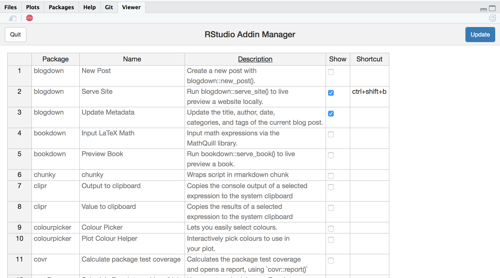

`rsam` provides a command line and user interface to manage RStudio addins. You can show or hide the addins in the RStudio IDE dropdown menu and set keyboard shortcuts for them. 

## Installation

Since `rsam` manages the RStudio addins it must write to disk. For this reason the package can not be hosted on [CRAN](https://cran.r-project.org/web/packages/rsam/index.html).

```{r,eval=FALSE}
#install.packages('remotes')
remotes::install_github('yonicd/rsam')
```

## Usage

```{r remedy001}
library(rsam)
```

### User Interface

The user interface is a shiny application that uses [rhandshontable](http://jrowen.github.io/rhandsontable/) to interact with the addins. The table includes a list of all the installed addins found in the `.libPaths()`, their description, a checkbox to control if the addin will be shown in the IDE dropdown menu and a column to define keyboard shortcuts.

Once you have decided which addins to toggle on or off you press the `update` button. This will update the RStudio files. The final (currently unavoidable) step is to restart RStudio to invoke the changes. 



### Command Line

Via the command line you can manage the addins with greater flexibility.

#### Retrieve Summary of Installed Addins
```{r remedy002,eval=FALSE}
fetch_addins()
```

#### Toggle Addins on/off
Every time a binding is passed to the `toggle_addin` function it will switch states.

```{r,eval=FALSE}
toggle_addin(key = c("blogdown::serve_site","blogdown::new_post_addin","blogdown::update_meta_addin"))
```

#### Building Keyboard Shortcuts
`rsam` has a validation for keyboard keys through the class `key`

```{r}

KEYS$`left command/window key`

KEYS$shift

KEYS$i

key <- KEYS$`left command/window key` + KEYS$shift + KEYS$i

key
```

#### Set Keyboard Shortcut for Addins

```{r,eval=FALSE}

set_shortcut(fn = 'blogdown::serve_site',shortcut = key)

#if the binding already has a shortcut mapped to it `overide` must be TRUE
set_shortcut(fn = 'blogdown::serve_site',shortcut = key, overide = TRUE)

```

#### Remove Keyboard Shortcut for Addins

```{r,eval=FALSE}
rm_shortcut(fn = 'blogdown::serve_site')
```


### Limited Liability Addins

`rsam` gives you 3 empty addins to pass into them whatever you want and run them as your personal addins. You can also set keyboard shortcuts for each one with `set_shortcut`.

Pass through an expression wrapped the global objects `rsam_fn_1()`, `rsam_fn_2()`, and `rsam_fn_3()` into the Rstudio Addin list. 


```{r, eval=FALSE}

rsam_fn_1 <- function(){
  library(ggplot2)
  library(dplyr)
  
  iris%>%ggplot(aes(x=Sepal.Length,y=Sepal.Width)) + geom_point()
}

# Change shortcuts to whatever you want

keys <- KEYS$`left command/window key` + KEYS$shift + KEYS$l

rsam::set_shortcut(fn = 'rsam::lla1',shortcut = keys + KEYS$`1`)

rsam::set_shortcut(fn = 'rsam::lla2',shortcut = keys + KEYS$`2`)

rsam::set_shortcut(fn = 'rsam::lla3',shortcut = keys + KEYS$`3`)

```
